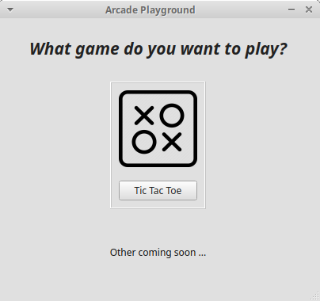
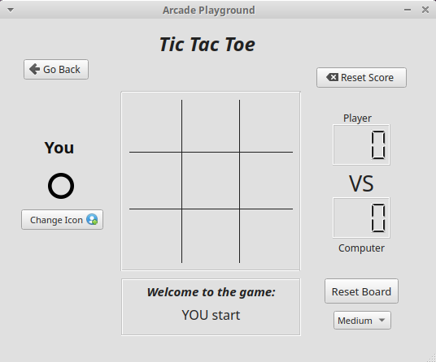

# Arcade Platform Game

Welcome to the Arcade Platform! This project is built using Qt and C++ to provide a rich, interactive, and user-friendly gaming experience. This project began as an opportunity to learn the Qt library and understand its working principles. The platform hosts a variety of classic games, with the initial release featuring Tic Tac Toe. Future releases will include more exciting games, like Tetris.

### Installation

1. **Clone the Repository**
   ```bash
   git clone https://github.com/yourusername/arcade-platform.git
   cd arcade-platform

### Building the project

### Running the project

### Application Overview
<p align="center">
    
    
</p>
